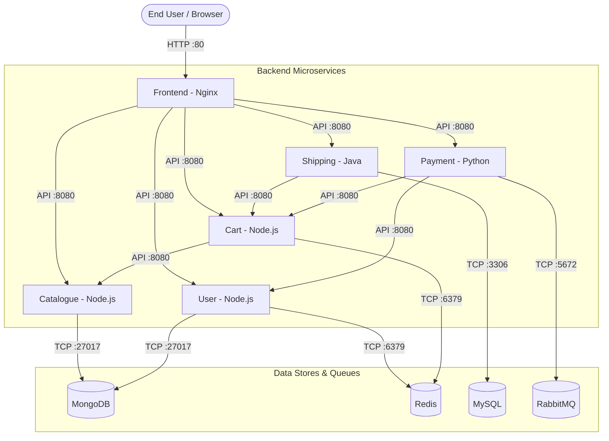

# 🛒 RoboShop Docker Microservices Project (`roboshop-docker`)

This repository contains **production-ready Dockerfiles**, **multi-stage build optimizations**, **security hardening configurations**, and a complete **Docker Compose orchestrator** for running the entire **RoboShop E-Commerce Microservices Application** locally or on EC2 instances.

---

## 📑 Table of Contents
1. [Architecture Overview](#-architecture-overview)
2. [Microservices & Database Matrix](#-microservices--database-matrix)
3. [Key Docker Optimization & Security Principles](#-key-docker-optimization--security-principles)
4. [Project Structure](#-project-structure)
5. [How to Run Everything with Docker Compose](#-how-to-run-everything-with-docker-compose)
6. [Individual Image Build & Push Commands](#-individual-image-build--push-commands)
7. [Network Troubleshooting with `debug` Container](#-network-troubleshooting-with-debug-container)
8. [Common Docker Commands & Cheatsheet](#-common-docker-commands--cheatsheet)

---

## 🏛️ Architecture Overview

RoboShop is a full-featured distributed e-commerce application consisting of frontend web servers, backend microservices, caching layers, message queues, and SQL/NoSQL databases:



---

## 📊 Microservices & Database Matrix

| Service | Runtime / Language | Port | Database / Dependency | Purpose |
| :--- | :--- | :--- | :--- | :--- |
| **`frontend`** | Nginx / Web | `80` | Reverse proxy to all microservices | Serves static Web UI & routes `/api/*` traffic |
| **`catalogue`** | Node.js (v20 Alpine) | `8080` | MongoDB (`27017`) | Manages product catalogue items & details |
| **`user`** | Node.js (v20 Alpine) | `8080` | MongoDB (`27017`), Redis (`6379`) | User authentication & profile management |
| **`cart`** | Node.js (v20 Alpine) | `8080` | Redis (`6379`), Catalogue (`8080`) | In-memory cart items management |
| **`shipping`** | Java (OpenJDK) | `8080` | MySQL (`3306`), Cart (`8080`) | Calculates shipping costs & order logistics |
| **`payment`** | Python | `8080` | RabbitMQ (`5672`), User, Cart | Handles checkout transactions & async queuing |
| **`mongodb`** | MongoDB NoSQL | `27017` | Persistent Volume `/data/db` | Document store for catalogue & user data |
| **`redis`** | Redis In-Memory | `6379` | Persistent Volume `/data` | Fast session & cart caching |
| **`mysql`** | MySQL Relational | `3306` | Persistent Volume `/var/lib/mysql` | Relational store for shipping schemas & cities |
| **`rabbitmq`**| AMQP Message Queue | `5672` | Persistent Volume `/var/lib/rabbitmq` | Asynchronous transaction queue |
| **`debug`** | AlmaLinux 9 | - | Network utilities (curl, ping, telnet, netstat) | Troubleshooting & testing container networking |

---

## 🛡️ Key Docker Optimization & Security Principles

All custom microservices in this repository follow industry-standard Docker best practices:

### 1. Multi-Stage Builds (`AS builder`)
- **Stage 1 (Builder)**: Resolves dependencies and builds application binaries (e.g., `npm install`, `mvn clean package`).
- **Stage 2 (Runtime)**: Copies **only** the compiled output and production modules into a fresh, minimal runtime container. Discards build tools and temporary caches.

### 2. Alpine Linux Base Images
- Standard images (`node:20` or `ubuntu`) are ~1GB+ in size.
- Alpine-based images (`node:20-alpine3.23`) reduce container footprints down to ~150-180MB, resulting in faster CI/CD pipelines, lower bandwidth usage, and smaller attack surfaces.

### 3. Layer Caching Strategy
- We copy dependency manifests first (`COPY package.json .` / `COPY pom.xml .`) before copying source code (`COPY *.js .`).
- Result: Changing source code will not trigger re-installation of third-party libraries.

### 4. Non-Root System User (`USER roboshop`)
- Prevents container breakout and privilege escalation attacks:
```dockerfile
RUN addgroup -S roboshop && adduser -S roboshop -G roboshop
RUN chown -R roboshop:roboshop /app
USER roboshop
```

---

## 📁 Project Structure

```
roboshop-docker/
├── docker-compose.yaml      # Master multi-container orchestrator file
├── README.md                # Comprehensive documentation
├── catalogue/               # Catalogue Node.js microservice
│   ├── Dockerfile           # Optimized multi-stage Dockerfile
│   ├── package.json         # Node.js dependencies
│   └── server.js            # Express API server
├── user/                    # User Node.js microservice
│   ├── Dockerfile
│   ├── package.json
│   └── server.js
├── cart/                    # Cart Node.js microservice
│   ├── Dockerfile
│   ├── package.json
│   └── server.js
├── shipping/                # Shipping Java microservice
│   ├── Dockerfile
│   └── pom.xml
├── payment/                 # Payment Python microservice
│   ├── Dockerfile
│   └── requirements.txt
├── frontend/                # Nginx Web Frontend
│   ├── Dockerfile
│   └── nginx.conf
├── mongodb/                 # MongoDB database initial schemas
│   └── Dockerfile
├── mysql/                   # MySQL schema loader
│   └── Dockerfile
└── debug/                   # Troubleshooting container with network utilities
    └── Dockerfile
```

---

## 🚀 How to Run Everything with Docker Compose

[`docker-compose.yaml`](file:///Users/sriramcharankolla/Desktop/DevOps/roboshop-docker/docker-compose.yaml) connects all microservices, sets environment variables, creates persistent storage volumes, and bridges network DNS discovery automatically.

### 1. Start all 10 Services in Background:
```bash
docker compose up -d --build
```

### 2. Check Running Containers & Health:
```bash
docker compose ps
```

### 3. Stream Live Logs:
```bash
# View logs from all services:
docker compose logs -f

# View logs from a specific service (e.g. catalogue):
docker compose logs -f catalogue
```

### 4. Access the Application:
Open your browser and navigate to:
```
http://localhost
# or
http://<EC2-PUBLIC-IP>
```

### 5. Stop and Clean Up:
```bash
# Stop all containers:
docker compose down

# Stop all containers AND delete database storage volumes:
docker compose down -v
```

---

## 🔨 Individual Image Build & Push Commands

To manually build and push individual service images to your Docker Hub repository (`ramcharankola2`):

```bash
# 1. Login to Docker Hub
docker login -u ramcharankola2

# 2. Build Catalogue
cd catalogue
docker build -t ramcharankola2/catalogue:1.0.0 .
docker push ramcharankola2/catalogue:1.0.0

# 3. Build User
cd ../user
docker build -t ramcharankola2/user:1.0.0 .
docker push ramcharankola2/user:1.0.0

# 4. Build Cart
cd ../cart
docker build -t ramcharankola2/cart:1.0.0 .
docker push ramcharankola2/cart:1.0.0

# 5. Build Shipping
cd ../shipping
docker build -t ramcharankola2/shipping:1.0.0 .
docker push ramcharankola2/shipping:1.0.0

# 6. Build Payment
cd ../payment
docker build -t ramcharankola2/payment:1.0.0 .
docker push ramcharankola2/payment:1.0.0

# 7. Build Frontend
cd ../frontend
docker build -t ramcharankola2/frontend:1.0.0 .
docker push ramcharankola2/frontend:1.0.0

# 8. Build Debug Container
cd ../debug
docker build -t ramcharankola2/debug:1.0.0 .
docker push ramcharankola2/debug:1.0.0
```

---

## 🛠️ Network Troubleshooting with `debug` Container

When debugging DNS resolution, service ports, or database handshakes between containers:

### 1. Build and Run the Debug Container on the Same Network:
```bash
docker build -t ramcharankola2/debug:1.0.0 ./debug
docker run -d --name debug-container --network roboshop ramcharankola2/debug:1.0.0
```

### 2. Exec into the Debug Container:
```bash
docker exec -it debug-container /bin/bash
```

### 3. Perform Network Diagnostics:
```bash
# Test DNS resolution and TCP port reachability:
telnet mongodb 27017
telnet redis 6379
telnet mysql 3306
telnet rabbitmq 5672

# Test HTTP REST Endpoints:
curl -i http://catalogue:8080/health
curl -i http://user:8080/health
curl -i http://cart:8080/health
```

---

## 📌 Common Docker Commands & Cheatsheet

| Command | Action |
| :--- | :--- |
| `docker ps` | List all running containers |
| `docker ps -a` | List all containers (including stopped) |
| `docker images` | List all locally cached Docker images |
| `docker logs -f <container_id>` | Stream live logs from a container |
| `docker exec -it <container_id> /bin/sh` | Open an interactive terminal inside a container |
| `docker system prune -af` | Remove all stopped containers, unused networks, and dangling images |
| `docker volume ls` | List all Docker persistent volumes |